# BASIC UNIX COMMANDS PRACTISE OUTPUT
## GENERAL  COMMANDS OUTPUTS 
### DATE COMMAND OUTPUT
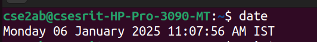   
### DATE COMMAND MANUAL

### DATE YEAR COMMAND OUTPUT
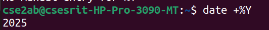
### DATE YEAR COMMAND MANUAL

### DATE HOUR COMMAND OUTPUT
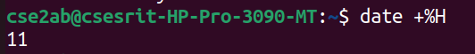
### DATE HOUR COMMAND MANUAL
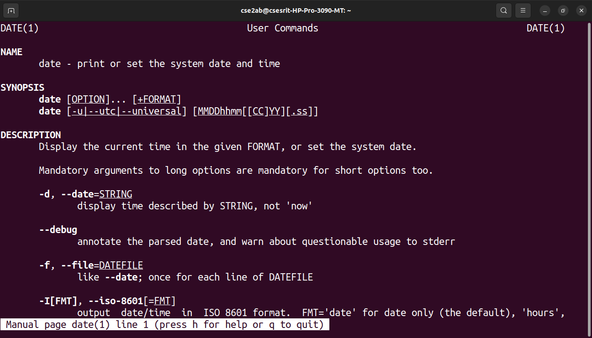
### CAL COMMAND OUTPUT
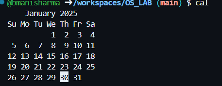
### CAL COMMAND MANUAL
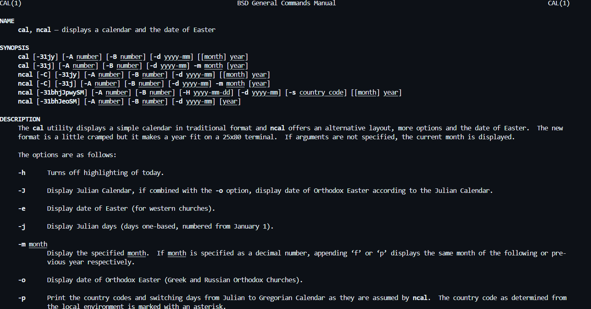
### CAL-YEAR COMMAND OUTPUT
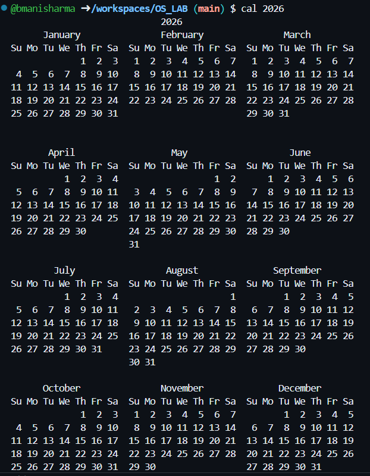
### CAL-YEAR COMMAND MANUAL

### CAL-MONTH COMMAND OUTPUT
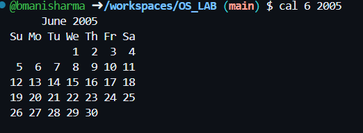
### CAL-MONTH COMMAND MANUAL

### WHO COMMAND OUTPUT 
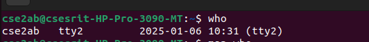
### WHO COMMAND MANUAL
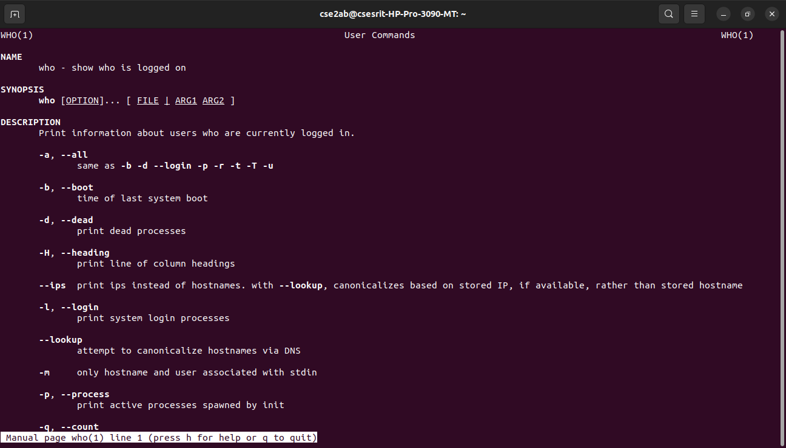
### WHO AM I COMMAND OUTPUT 
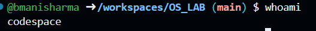
### WHO AM I COMMAND MANUAL
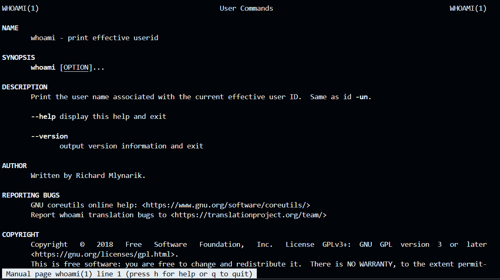
### TTY COMMAND OUTPUT -TERMINAL NAME-

### TTY COMMAND MANUAL
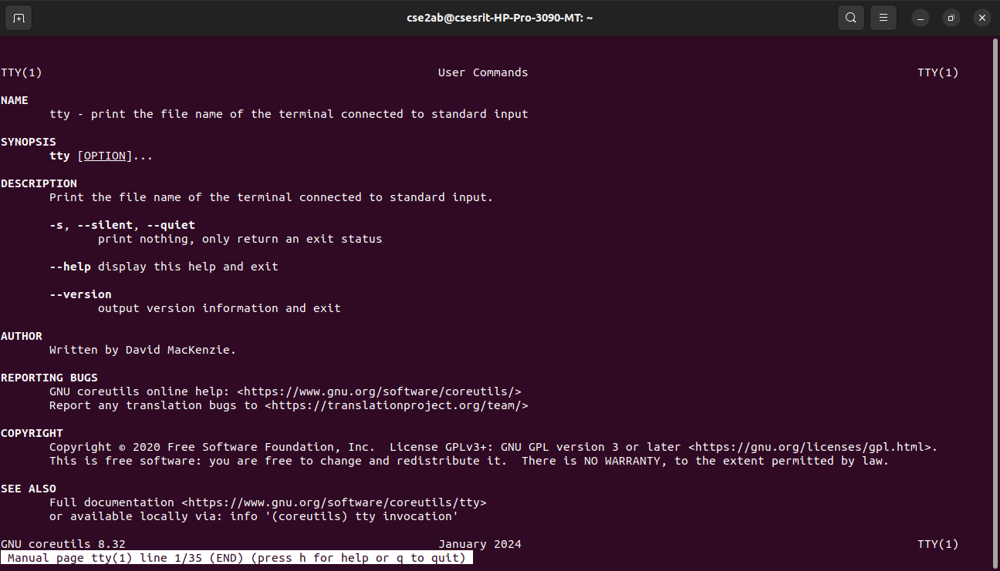
### UNAME COMMAND OUTPUT

### UNAME COMMAND MANUAL
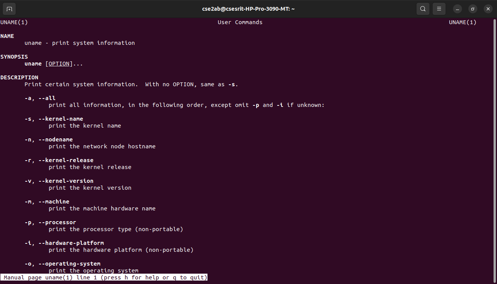
### UNAME-R COMMAND OUTPUT

### UNAME-R COMMAND MANUAL

### UNAME-N COMMAND OUTPUT

### UNAME-N COMMAND MANUAL

### ECHO COMMAND OUTPUT

### ECHO COMMAND MANUAL

### ECHO $ COMMAND OUTPUT

### ECHO $ COMMAND MANUAL 

### BC - BASIC CALCULATOR COMMAND OUTPUT
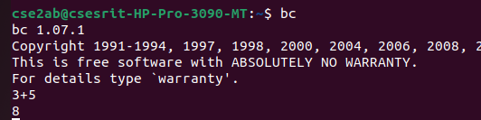
### BC - BASIC CALCULATOR COMMAND MANUAL

## IP FILE COMMANDS
### MAN COMMONAD OUTPUT

### HISTORY COMMAND OUTPUT
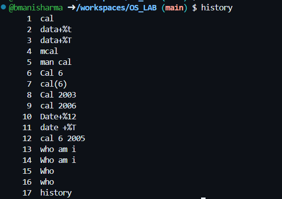
### HISTORY COMMAND MANUAL 
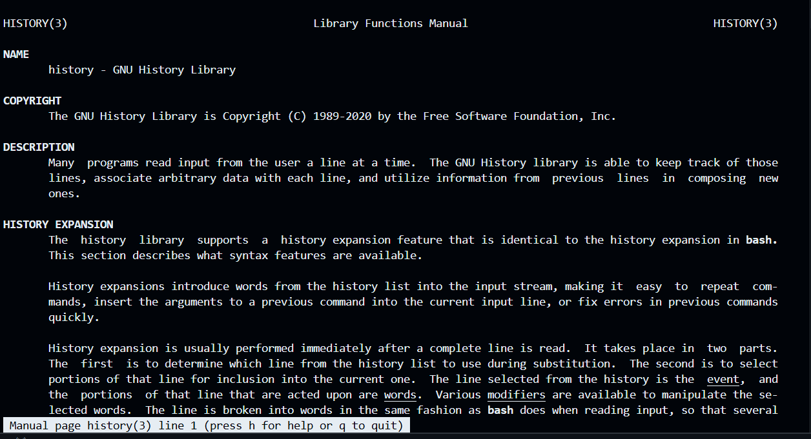
## DIRECTIORY COMMANDS
### PWD COMMAND OUTPUT

### PWD COMMAND MANUAL

### MKDIR COMMAND OUTPUT

### MKDIR COMMAND MANUAL
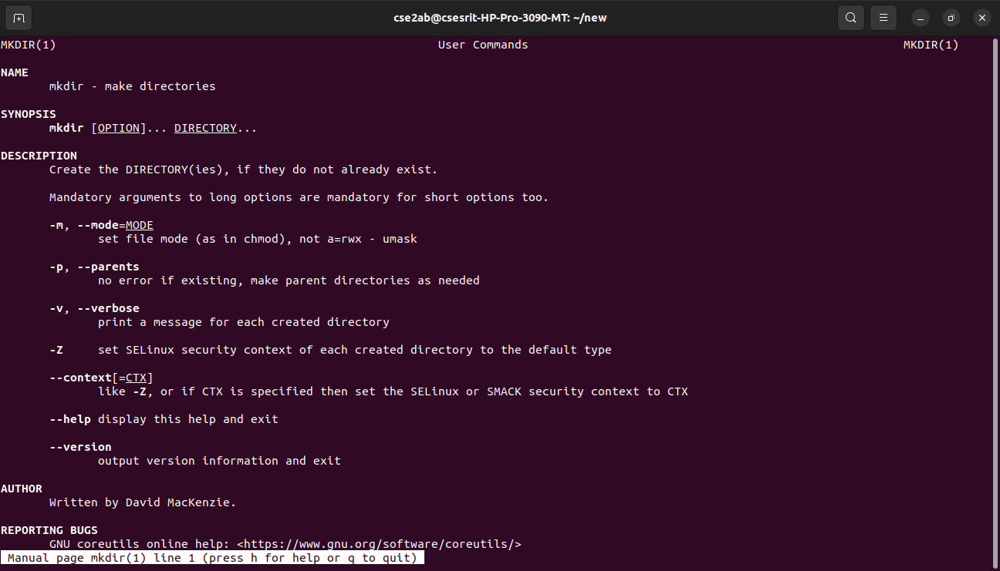
### CD  SUBDIR COMMAND OUTPUT

### CD SUBDIR COMMAND MANUAL

### CD .. COMMAND OUTPUT
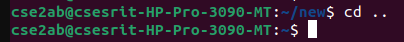
### CD .. COMMAND MANUAL
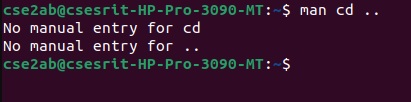
### RMDIR COMMAND OUTPUT
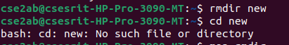
### RMDIR COMMAND MANUAL

## FILE COMMANDS
### CAT COMMAND OUTPUT
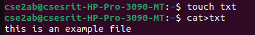
### CAT COMMAND MANUAL
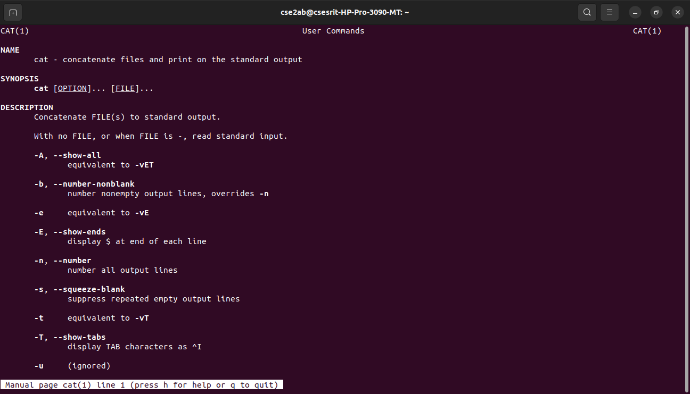
### CAT >> COMMAND OUTPUT
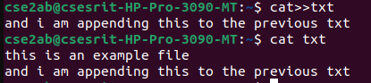
### CAT >> COMMAND MANUAL 

### CP COMMAND OUTPUT
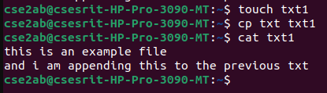
### CP COMMAND MANUAL
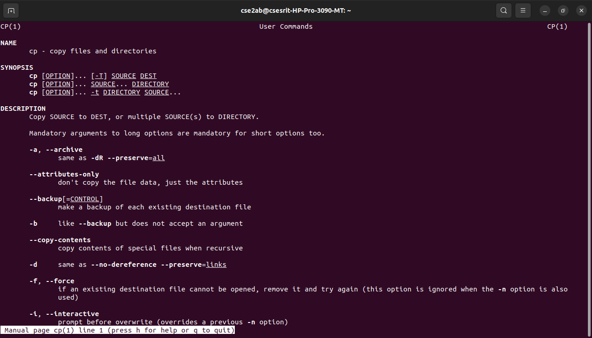
### CP -I COMMAND OUTPUT
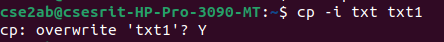
### CP -I COMMAND MANUAL

### CP -R COMMAND OUTPUT
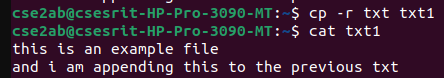
### CP -R COMMAND MANUAL

### MV OLD NEW COMMAND OUTPUT
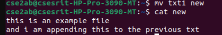

### MV -V OLD NEW COMMAND OUTPUT
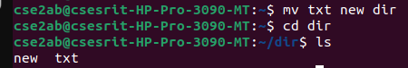

### LS COMMAND OUTPUT
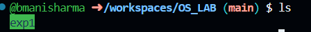
### LS COMMAND MANUAL
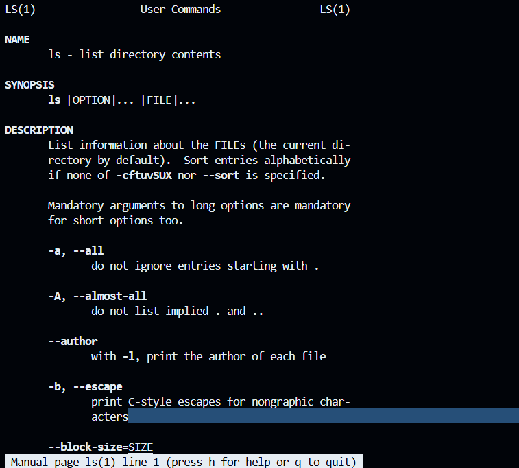

### LS - A COMMAND OUTPUT

### LS - A COMMAND MANUAL

### LS -R COMMAND OUTPUT
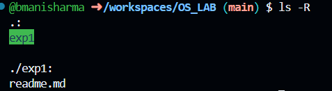
### LS -R COMMAND MANUAL

### LS - L COMMAND OUTPUT
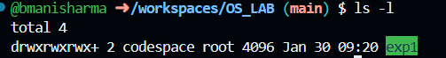
### LS -L COMMAND MANUAL

# The Study And Execution Of Unix Commands Has Been Completed Successfully.
